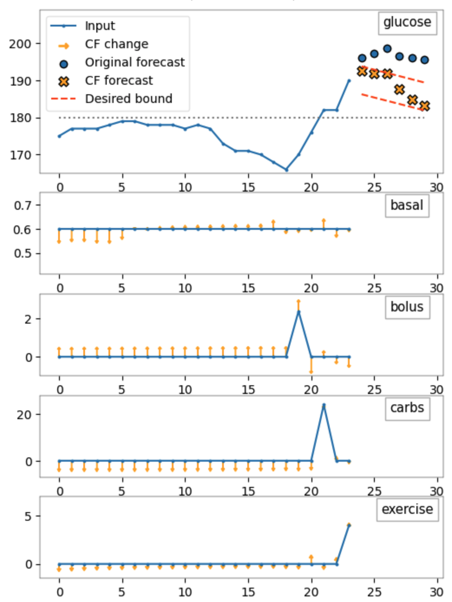

# Constrained Counterfactual Explanations for Patient Glucose Multivariate Forecasting

COMET: Constrained Counterfactual Explanations for Patient Glucose Multivariate Forecasting<br/>
2024 IEEE International Symposium on Computer-Based Medical Systems (CBMS 2024)<br/>
[[paper_link]](https://ieeexplore.ieee.org/abstract/document/10600898)
[[presentation_slides]](./results/CBMS2024_COMETCF.pdf) 

To propose actionable counterfactuals in a multivariate forecasting setup, additional constraints should be imposed on the actions suggested by the counterfactual explainer. In this study, we focus on multivariate-to-univariate  forecasting, with the objective to define meaningful and medically relevant counterfactual explanations in the blood glucose forecasting scenario. Specifically, we define three domain-specific constrain mechanisms designed explicitly for CGM monitoring controls for type 1 diabetes patients: 
- (1) Clipping constraint; 
- (2) Activity temporal constraint;
- (3) Historical values constraint. 

With the additional constraint mechanisms, our proposed COMET method can generate counterfactual samples that are clinically relevant, while following the forecasting trend of avoiding hyperglycaemic and hypoglycaemic events.

If you find this GitHub repo useful in your research work, please consider citing our paper:
```
@inproceedings{wang_comet_2024,
	title = {{COMET}: {Constrained} {Counterfactual} {Explanations} for {Patient} {Glucose} {Multivariate} {Forecasting}},
	doi = {10.1109/CBMS61543.2024.00089},
	booktitle = {2024 {IEEE} 37th {International} {Symposium} on {Computer}-{Based} {Medical} {Systems} ({CBMS})},
	author = {Wang, Zhendong and Samsten, Isak and Miliou, Ioanna and Papapetrou, Panagiotis},
	month = jun,
	year = {2024},
	pages = {502--507},
}
```

## Experimental Setup

### Dependencies
For reproducibility, all the experiments and the computational runtime are evaluated with NVIDIA GeForce RTX 2080 (GPU) and AMD Ryzen Threadripper 2950X 16-Core Processor (CPU), with `python=3.9`.

### Installation:
```
pip install -r requirements.txt
```

### Data preparation
We conducted our experiments on two datasets:
- *SimGlucose*: a simulated dataset from the FDA-approved UVA/PADOVA type 1 diabetes simulator;  
- *OhioT1DM*: a real-world diabetes patient dataset, containing over 60,000 measurements for twelve type-1 diabetes patients collected over 8 weeks by Ohio University.

We employed two main DL forecasting models: a 2-layer GRU model and a WaveNet model. Specifically, the glucose forecasting task involved using the previous 2 hours’ patient measurements to forecast glucose values in the following 30 minutes. For the OhioT1DM dataset, this setup was equivalent to 24 timesteps for the back horizon and 6 timesteps.

### Reproduce the experiments
Run the main experiment:

```
bash run_main_test.sh
```

## Examples
We provide two example counterfactuals from OhioT1DM as a qualitative analysis of the performance difference between COMET-CF and the baseline models:

<table>
  <tr>
    <td></td>
    <td></td>
  </tr>
    <tr>
    <td align="center">COMET-CF</td>
    <td align="center">Baseline</td>
  </tr>
 </table>

The counterfactual examples show one specific OhioT1DM patient with a forecasted hyperglycemic event in the next 30 minutes (i.e., 6 timesteps). The blue lines show the original time series inputs with five measurements, and the orange arrows demonstrate the counterfactual suggestions. The red-dotted curves show the forecast constraints that the predicted values (yellow points) of the counterfactuals are more desired to fall into; the blue points are the original forecasted values. This comparison indicated that our proposed approach could generate counterfactuals following clinically relevant constraints and provide relatively valid prediction trends towards the desired patient outcome.


### Results and supplementaries
The results of the quantitative analysis are available in the [results folder](./results/).